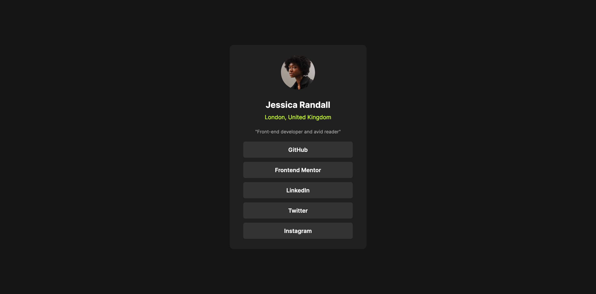

# Frontend Mentor - Social links profile solution

This is a solution to the [Social links profile challenge on Frontend Mentor](https://www.frontendmentor.io/challenges/social-links-profile-UG32l9m6dQ). Frontend Mentor challenges help you improve your coding skills by building realistic projects. 

## Table of contents

- [Overview](#overview)
  - [The challenge](#the-challenge)
  - [Screenshot](#screenshot)
  - [Links](#links)
- [My process](#my-process)
  - [What I learned](#what-i-learned)
  - [Continued development](#continued-development)
- [Author](#author)
- [Acknowledgments](#acknowledgments)

**Note: Delete this note and update the table of contents based on what sections you keep.**

## Overview

### The challenge

Users should be able to:

- See hover and focus states for all interactive elements on the page

### Screenshot

### Links

- Solution URL: [GitHub Repository](https://github.com/JonKnitt1205/social-card-challenge)
- Live Site URL: [GitHub Pages](https://jonknitt1205.github.io/social-card-challenge/)

## My process
### What I learned

I used css variables for repeating use of certain colors, added hover and active effects, and learned to style a link to look more like a button.

### Continued development

This is my second challenge and I am starting to get faster and more confident with simple HTML/CSS. Google and StackOverflow were used significantly less this time around. I hope to continue on some of these easier challenges so that I feel prepared moving onto harder ones.

## Author

- Frontend Mentor - [@JonKnitt1205](https://www.frontendmentor.io/profile/JonKnitt1205)